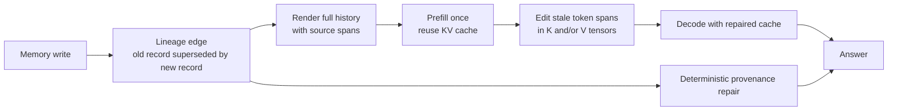

# LineageKV

Lineage-guided stale-memory repair for reused Transformer KV caches.

LineageKV studies a concrete failure mode in long-lived agents: the prompt can
contain both historical records and records that supersede them. The old record
may still be useful for audit or temporal reasoning, but it should not control
the next action. This repo provides a benchmark, cache-editing probes, result
artifacts, and a paper draft for testing whether stale influence can be
suppressed after prefill without deleting history from the memory store.

## Core Idea



The method separates two concerns:

- **Historical retention:** keep superseded records in the memory history.
- **Operational freshness:** suppress stale records' influence in the live KV cache.

The strongest policy in the current public artifact is value-only repair over
stale spans: preserve keys, zero stale values over a selected layer band, and
use the same lineage graph to return current source IDs.

## Mechanism

For one attention head, cached keys and values affect a generated token through:

```math
a_{t,p}
=
\frac{\exp(q_t^\top k_p / \sqrt{d_h})}
     {\sum_{r \le t} \exp(q_t^\top k_r / \sqrt{d_h})},
\qquad
o_t = \sum_{p \le t} a_{t,p} v_p
```

For a lineage-stale token span `S`, value-only repair leaves keys fixed and
zeros stale values. Locally, for that edited attention operation:

```math
a'_{t,p}=a_{t,p},
\qquad
o'_t - o_t
=
-\sum_{p \in S} a_{t,p} v_p
```

So value repair subtracts the stale value contribution while preserving the
key-addressed attention distribution. Key-only repair instead changes the
attention logits and can redistribute attention through the softmax denominator.

## Main Results

| Experiment | Baseline Failure | LineageKV Result |
| --- | --- | --- |
| MLX Qwen2.5-7B, 32 long-context cases | full cache uses stale evidence on 25% of rows | value repair keeps 1.000 answer accuracy, improves evidence to 0.9688, stale use 0.0313 |
| Persistent update at 6.7k tokens | prompt deletion requires re-prefill | cache repair is 15.35x faster |
| Persistent update at about 32k tokens | prompt deletion update path grows with prefill | cache repair reaches 38.46x speedup |
| Raw Gemma 4 E4B, 32 adversarial cases | full cache 0.812 accuracy / 0.281 stale use | value repair 1.000 accuracy / 0.031 stale use; provenance repair restores 1.000 joint answer+source correctness |
| Public targeting benchmark | hidden stale labels are removed from detector inputs | lineage and text+timestamp resolvers both reach 224 TP / 0 FP / 0 FN |

The scientific claim is intentionally scoped: this is not presented as a
universal transformer law. The results support a systems contract and a
model/domain phase diagram for stale-memory repair.

## Motivation

Prompt deletion fixes stale memory by rebuilding the prompt and cache without
the old record. That is simple, but it loses historical context and becomes
expensive when a long prefix cache is already warm.

LineageKV keeps the full history available, reuses the prefetched cache, and
applies a source-local edit to stale spans. That makes the technique relevant
to local serving systems, agent memory stores, and future runtimes that expose
editable KV cache state.

## Repository Map

| Path | Contents |
| --- | --- |
| `src/context_rot/` | Benchmark, prompting, grading, model adapters, and memory ledger code |
| `scripts/` | Dataset builders, KV probes, audits, public repro script, and result summarizers |
| `data/public/` | 184-case stale-memory benchmark and 264-case universality trace benchmark |
| `data/generated/` | Small checked-in source probes needed by the public repro path |
| `results/kv/` | Compact result artifacts referenced by the paper and README |
| `docs/` | Public research notes for the method, protocol, and phase diagram |
| `paper/` | LaTeX manuscript and compiled PDF |
| `demo/kv_memory_repair_demo.html` | Standalone browser demo of stale-memory repair |

## Quick Start

```bash
python3 -m venv .venv
source .venv/bin/activate
python3 -m pip install -U pip
python3 -m pip install -e ".[dev]"
python3 -m pytest -q
```

Rebuild the public no-model artifacts:

```bash
bash scripts/run_kv_public_repro.sh
```

This regenerates the public benchmarks, targeting audit, runtime curve, and
paired bootstrap summaries from checked-in compact artifacts. It does not
download model weights or rerun expensive inference.

## Public Benchmarks

| File | Rows | Purpose |
| --- | ---: | --- |
| `data/public/stale_memory_repair_benchmark_v1.jsonl` | 184 | Assistant-memory stale/current repair cases |
| `data/public/stale_memory_universality_traces_v1.jsonl` | 264 | Mixed assistant-memory and public Git-history traces |

Each row includes current evidence IDs, stale IDs, distractors, timestamps, and
memory metadata. The benchmark supports both explicit lineage targeting and
text+timestamp currentness targeting.

## Method Documents

- [Technical report](docs/kv_cache_repair_technical_report.md)
- [Memory lineage protocol](docs/kv_memory_lineage_protocol.md)
- [Lineage targeting validity](docs/kv_lineage_targeting_validity.md)
- [Address/content causal map](docs/kv_address_content_causal_map.md)
- [Repair phase diagram](docs/kv_repair_phase_diagram.md)
- [Memory-store integration](docs/kv_memory_store_lineage_integration.md)

## Paper

The manuscript source is [paper/stale_memory_kv_cache_repair.tex](paper/stale_memory_kv_cache_repair.tex).
The compiled preview is [paper/stale_memory_kv_cache_repair.pdf](paper/stale_memory_kv_cache_repair.pdf).

Build it locally:

```bash
cd paper
pdflatex -interaction=nonstopmode -halt-on-error stale_memory_kv_cache_repair.tex
pdflatex -interaction=nonstopmode -halt-on-error stale_memory_kv_cache_repair.tex
```

## Limitations

- The strongest 7B runtime result is MLX 4-bit Qwen2.5, not a full-precision CUDA replication.
- The Gemma matrix is a raw second-family result, but it is still synthetic adversarial-lineage data.
- The cache policy depends on model family, layer band, prompt format, and domain.
- The method assumes useful memory lineage, timestamps, or another reliable currentness signal.
- Attention-mask and span-eviction baselines remain important future comparisons.

## License

MIT.
